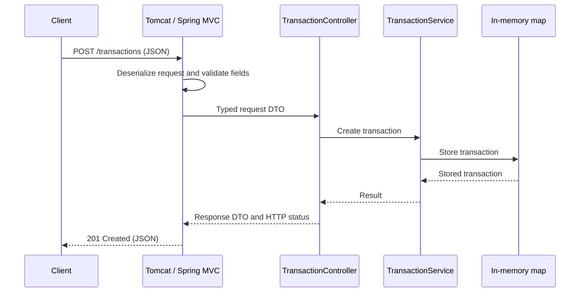

# Phase 0 and Phase 1 architecture

## Phase 0: executable skeleton

One independently buildable service under `services/transaction-service`.
Java 25, Spring Boot 3.5.16, and Maven. Only the entry point, runtime configuration,
build definition, and startup integration test exist. Use installed Maven now;
a version-pinned Maven wrapper is a future tooling improvement.

## Phase 1: proposed request flow

This diagram describes future Phase 1 code; no endpoint has been implemented.

Tomcat accepts HTTP traffic. Spring MVC selects the route; Jackson turns JSON
into a Java request object. Validation will run when the endpoint explicitly
requests it. A controller translates HTTP into a service call. A service owns
transaction creation rules and an in-memory map initially. Jackson turns the
response object back into JSON. Invalid JSON, validation failures, and business
exceptions will take an error path that we design and test in Phase 1.

Proposed Java types, introduced one at a time in the existing package tree:

- `TransactionType`: enum of permitted types, starting with PAYMENT.
- `CreateTransactionRequest`: DTO describing input, roughly analogous to a
  Pydantic request model. DTO means Data Transfer Object.
- `Transaction`: immutable stored representation; evaluate Java records then.
- `TransactionResponse`: output DTO so the public API does not depend on internal
  storage details. Introduce only once we decide which fields the API exposes.
- `TransactionService`: concrete class with creation behavior and memory storage.
- `TransactionController`: HTTP routes and status codes.
- `TransactionExceptionHandler`: consistent HTTP error translation when needed.

No interface or repository abstraction is justified yet: there is only one
implementation. Do not create placeholder types or empty package directories.
Use BigDecimal for money and Instant for timestamps when those fields appear;
we will teach both before use. Decide client IDs, duplicate requests, currencies,
precision, and timestamp policy explicitly rather than silently guessing.

## Dependency injection

A controller depends on a service. With constructor injection, it receives that
service as a constructor argument, much like `Controller(service)` in Python.
Spring constructs and wires registered objects (called beans) in its application
context. We will use a concrete service and constructor injection so dependencies
are visible and plain unit tests can construct the same objects directly. Being
a Spring bean does not make an object's mutable state thread-safe.

## Why this boundary

Separate HTTP handling from financial rules so rules can be tested without an
HTTP server. Keep both inside one process so Java and Spring can be learned
before network failure and distributed coordination enter the design.

The memory store is a deliberate learning limitation: it loses all records when
the JVM exits, is private to one process, and must handle concurrent requests.
We will discuss race conditions before choosing a collection or duplicate policy.
This phase is not suitable for real financial traffic, and is local-only.

## Phase 1 completion gate

Small reviewed tasks will cover Java types, DTOs, controller/service wiring,
creation and read-back, request validation, consistent errors, and tests.
Tests must cover valid requests, invalid input, missing records, and whatever
duplicate/ID policy we agree. Document the memory store's failure behavior.
Do not move to PostgreSQL or Phase 2 until the learner explicitly says Phase 1
is complete. Kafka, reconciliation, Redis, risk scoring, observability stacks,
containers, and Kubernetes are deferred.
